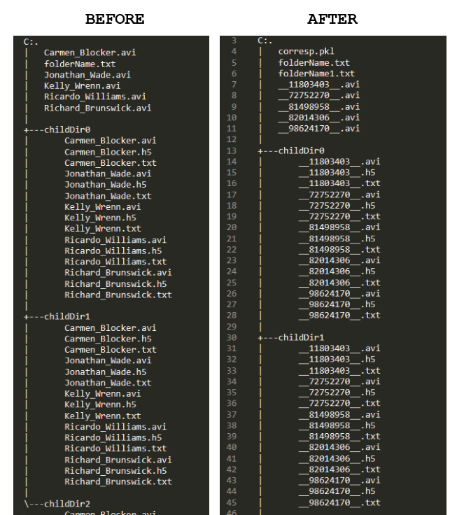

# anonymous

## Introduction 

Example to blind the data make data anonymous while generating a corresponding file that can be used later on to retrieve the data

*TODO: improve doc and functionality*

## Process

To test out the principles:
1. generate a random folder/file structure `exampleGen.py`
2. see `anonymous.py` for usage

## Example output

